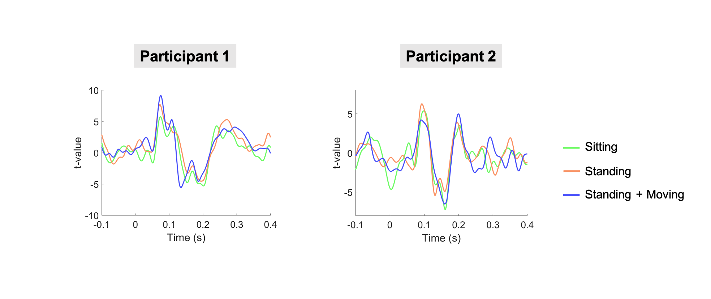

# movement_auditory_ERF
Analysis scripts for the study:

## Seymour et al., (2021). Using OPMs to measure neural activity in standing, mobile participants. Submitted. 

### Pre-Print

BioRxiv: **[LINK](https://www.biorxiv.org/content/10.1101/2021.05.26.445793v1)**

### Requirements:

- Fieldtrip Toolbox
- Motion Capture Scripts: https://github.com/FIL-OPMEG/optitrack
- analyse_OPMEG: https://github.com/neurofractal/analyse_OPMEG

### Main script:

- [pipeline.m](./pipeline.m)

### Contact

For any enquiries regarding these scripts, please open an issue on Github or email me **[[LINK](rob.seymour@ucl.ac.uk)]**

### Data Sharing:

- Anonymised OPM and motion capture data can be requested from Dr. Robert Seymour for steps 1-5
- We are currently in the process of organising the data for sharing via OpenNeuro

